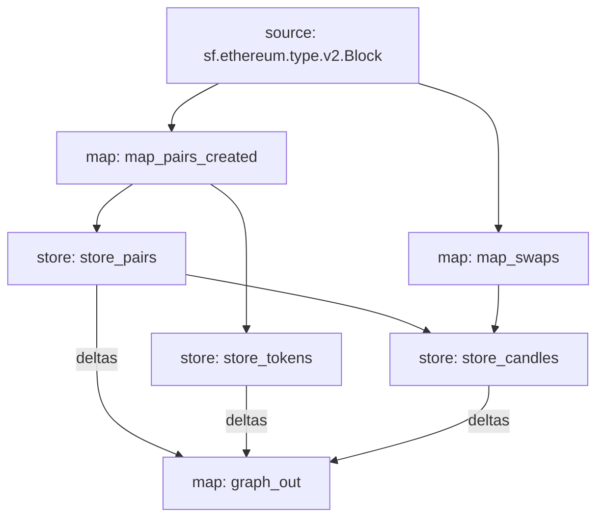

# TraderJoe - DexCandles V2 Substreams

Candle-sticks data for trading on Joe-V2 (5m/15m/1h/4h/1d/1w) powered by Substreams.

The subgraph indexes all trades for a given tokenX-tokenY pair.

## Data Flow
